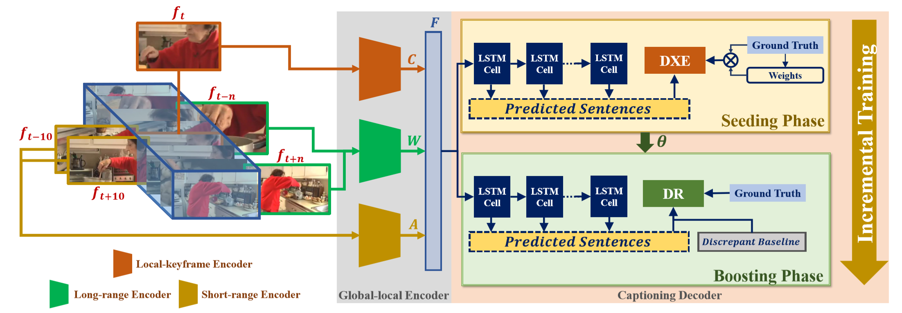

# GL-RG: Global-Local Representation Granularity for Video Captioning



## Dependencies

* Python 2.7
* Pytorch 0.2
* [Microsoft COCO Caption Evaluation](https://github.com/tylin/coco-caption)
* [CIDEr](https://github.com/plsang/cider)
* torch, numpy, scikit-image, h5py 


## Installation
Please run to download Stanford CoreNLP models:

```bash
cd coco-caption
./get_stanford_models.sh
```

If `coco-caption/`, `data/` or `model/` has not be prepared, please find detailed steps [Here](docs/INSTALL.md) for installation and dataset preparation.

## Model Zoo
| Model | Dataset | Exp. | B@4 | M | R | C | Download Link |
| :--------: | :---------: | :-----------: | :----------: | :----------: | :----------: | :----------: | :----------: |
| GL-RG | MSR-VTT | XE | 45.5  | 30.1 | 62.6 | 51.2 | [Google Drive]() |
| GL-RG | MSR-VTT | DXE | 46.9 | 30.4 | 63.9 | 55.0 | [Google Drive]() |
| GL-RG + IT | MSR-VTT | DR | 46.9 | 31.2 | 65.7 | 60.6 | [Google Drive]() |
| GL-RG | MSVD | XE | 52.3  | 33.8 | 70.4 | 58.7 | [Google Drive]() |
| GL-RG | MSVD | DXE | 57.7 | 38.6 | 74.9 | 95.9 | [Google Drive]() |
| GL-RG + IT | MSVD | DR | 60.5 | 38.9 | 76.4 | 101.0 | [Google Drive]() |

## Test
Please check the trained model weights under the `model/` directory (following [Installation](docs/INSTALL.md) ) and run:
```bash
./test.sh
```

**Note:** Please reset `MODEL_NAME`, `EXP_NAME` and `DATASET` in `test.sh` if running with different models.

## License

`GL-RG` is released under the MIT license.
